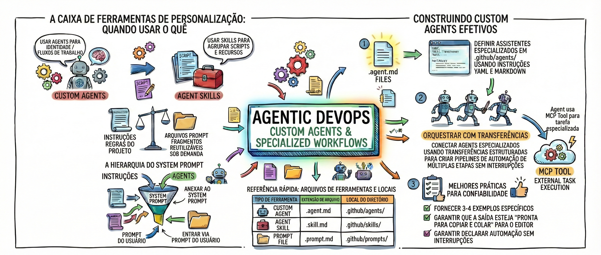

# TodoApp Workshop — Agentic DevOps com GitHub Copilot

> **Workshop prático** · **Nível**: Iniciante a Avançado · **Idioma**: Português do Brasil

## Sobre o Workshop

Este é um **workshop hands-on de Agentic DevOps** — uma abordagem que usa **agentes de IA especializados** para automatizar o ciclo de vida de desenvolvimento de software (SDLC). Em vez de usar o GitHub Copilot como um assistente genérico, ensinamos a criar um **time de agentes AI** onde cada um tem uma função específica: um que implementa frontend, outro que cuida de banco de dados, outro que faz code review, e um orquestrador que coordena todos eles.

### A Proposta

Construímos um **TodoApp completo** (task manager com Kanban board, integração GitHub Issues e Docker Compose) usando **exclusivamente** o GitHub Copilot em Agent Mode. O app em si não é o objetivo — ele é o **veículo prático** para demonstrar como:

1. **Criar Custom Agents** (`.agent.md`) — personas especializadas com ferramentas restritas
2. **Criar Agent Skills** (`SKILL.md`) — conhecimento de domínio reutilizável com checklists e workflows
3. **Criar Custom Instructions** (`.instructions.md`) — regras automáticas por tipo de arquivo
4. **Criar Prompt Files** (`.prompt.md`) — prompts reutilizáveis para tarefas recorrentes
5. **Orquestrar múltiplos agentes** — um orchestrator que delega, valida handoffs e garante qualidade
6. **Integrar ferramentas externas via MCP** — Figma, Azure, PostgreSQL, GitHub

### O que Foi Construído

O resultado é um sistema com **7 agentes especializados**, **8 skills de domínio**, **4 instructions automáticas**, **3 prompts reutilizáveis**, e **31 diagramas educativos** — tudo documentado em pt-BR.

[](images/github-copilot-agents-flow-diagram-PT.jpeg)

O diagrama acima resume todo o ecossistema. Vamos detalhar cada seção:

**🔧 Caixa de Ferramentas** (canto superior esquerdo): Define **quando usar cada tipo de customização** — Custom Agents para identidade/fluxos, Skills para agrupar conhecimento, Instructions para regras automáticas, e Prompt Files para tarefas recorrentes.

**📄 Referência Rápida** (centro inferior): Os três tipos de arquivo e onde ficam no repositório:

| Tipo de Ferramenta | Extensão | Local |
|--------------------|----------|-------|
| Custom Agent | `.agent.md` | [`.github/agents/`](.github/agents/README.md) |
| Agent Skill | `SKILL.md` | [`.github/skills/`](.github/skills/README.md) |
| Prompt File | `.prompt.md` | [`.github/prompts/`](.github/prompts/README.md) |

**🔀 Hierarquia do System Prompt** (canto inferior esquerdo): Como as camadas de contexto se combinam — Instructions entram no system prompt, a persona do Agent é adicionada, e o prompt do usuário fecha o contexto.

**🏗️ Construindo Agents Efetivos** (canto superior direito): Três passos — (1) definir assistentes em `.agent.md` com YAML e Markdown, (2) orquestrar com handoffs estruturados, (3) aplicar boas práticas para confiabilidade.

**☁️ MCP Tool** (canto direito): Ferramentas externas que os agentes podem chamar — neste projeto, usamos o Figma MCP para gerar os diagramas visuais diretamente pelo Copilot.

---

## 🤖 GitHub Copilot — Capacidades Usadas

O [GitHub Copilot](https://docs.github.com/en/copilot/get-started/what-is-github-copilot) é um assistente de codificação com IA que vai além de autocompletar código. Neste workshop usamos:

| Capacidade | O que faz | Link oficial |
|------------|-----------|--------------|
| **Agent Mode** | Executa ações: editar arquivos, rodar comandos, buscar código | [Docs](https://docs.github.com/en/copilot/using-github-copilot/using-copilot-agent-mode) |
| **Custom Agents** | Agentes personalizados com personas e tools específicas | [Docs](https://docs.github.com/en/copilot/reference/customization-cheat-sheet) |
| **Agent Skills** | Conhecimento de domínio reutilizável em pastas SKILL.md | [Docs](https://docs.github.com/en/copilot/concepts/agents/about-agent-skills) |
| **Custom Instructions** | Regras automáticas do Copilot por tipo de arquivo | [Docs](https://docs.github.com/en/copilot/customizing-copilot/adding-repository-custom-instructions-for-github-copilot) |
| **MCP Servers** | Integrar ferramentas externas (Figma, Azure, PostgreSQL) | [Docs](https://docs.github.com/en/copilot/customizing-copilot/extending-copilot-chat-with-mcp) |

---

## 📚 Conceitos Fundamentais

Cada conceito tem sua documentação detalhada nos sub-diretórios. Aqui vai o resumo:

### Custom Agents (`.agent.md`)

Um arquivo Markdown com frontmatter YAML que define uma **persona especializada**. O campo `description` é usado pelo Copilot para decidir quando invocar o agente. O campo `tools` restringe quais ferramentas ele pode usar.

```yaml
---
name: orchestrator
description: 'Detecta tipo de tarefa, carrega skill correspondente, delega para subagentes'
---
```

**Neste projeto**: 7 agentes em [`.github/agents/`](.github/agents/README.md)
📖 [Customization Cheat Sheet](https://docs.github.com/en/copilot/reference/customization-cheat-sheet)

### Agent Skills (`SKILL.md`)

Pasta com um `SKILL.md` contendo **conhecimento de domínio reutilizável** — regras, checklists, exemplos. É um [padrão aberto](https://github.com/agentskills/agentskills). O Agent define *quem faz*, a Skill define *como fazer*.

**Neste projeto**: 8 skills em [`.github/skills/`](.github/skills/README.md)
📖 [About Agent Skills](https://docs.github.com/en/copilot/concepts/agents/about-agent-skills)

### Custom Instructions (`.instructions.md`)

Regras automáticas aplicadas por tipo de arquivo via `applyTo` (glob patterns). Não precisa pedir — o Copilot aplica sozinho quando trabalha com arquivos correspondentes.

**Neste projeto**: 4 instructions (TypeScript, React, Docker, OWASP) em [`.github/agents/instructions/`](.github/agents/instructions/README.md)
📖 [Custom Instructions](https://docs.github.com/en/copilot/customizing-copilot/adding-repository-custom-instructions-for-github-copilot)

### Prompt Files (`.prompt.md`)

Prompts reutilizáveis para tarefas recorrentes. Definem `mode: agent` ou `mode: ask` no frontmatter.

**Neste projeto**: 3 prompts (build, code review, nova feature) em [`.github/prompts/`](.github/prompts/README.md)

### MCP — Model Context Protocol

Protocolo aberto para integrar ferramentas externas. Neste workshop, usamos o **Figma MCP** para gerar 31 diagramas visuais diretamente pelo Copilot.
📖 [Extending Copilot Chat with MCP](https://docs.github.com/en/copilot/customizing-copilot/extending-copilot-chat-with-mcp)

---

## 🏗️ O que o Workshop Produziu

### 7 Custom Agents

| Agente | Arquivo | Responsabilidade |
|--------|---------|------------------|
| **Orchestrator** | [`orchestrator.agent.md`](.github/agents/orchestrator.agent.md) | Coordena workflows, delega para subagentes, valida handoffs |
| **Expert React Frontend** | [`expert-react-frontend-engineer.agent.md`](.github/agents/expert-react-frontend-engineer.agent.md) | React 19, hooks, Zustand, TailwindCSS, acessibilidade |
| **PostgreSQL DBA** | [`postgresql-dba.agent.md`](.github/agents/postgresql-dba.agent.md) | Schema Prisma, queries, indexes, migrações |
| **DevOps Expert** | [`devops-expert.agent.md`](.github/agents/devops-expert.agent.md) | Dockerfile, docker-compose, CI/CD |
| **QA** | [`qa.agent.md`](.github/agents/qa.agent.md) | Testes, bug hunting, edge cases |
| **Debug Mode** | [`debug.agent.md`](.github/agents/debug.agent.md) | Investigação de bugs, root cause analysis |
| **Code Reviewer** | [`code-reviewer.agent.md`](.github/agents/code-reviewer.agent.md) | Review TypeScript, Zod, Prisma, OWASP |

### 8 Skills

| Skill | Tipo | Fases / Conteúdo |
|-------|------|------------------|
| [`workflow-feature`](.github/skills/workflow-feature/SKILL.md) | Workflow | Plan → Implement → Review → Verify |
| [`workflow-bugfix`](.github/skills/workflow-bugfix/SKILL.md) | Workflow | Reproduce → Debug → Fix → Test |
| [`workflow-deploy`](.github/skills/workflow-deploy/SKILL.md) | Workflow | Build → Test → Lint → Verify |
| [`workflow-code-review`](.github/skills/workflow-code-review/SKILL.md) | Workflow | Lint → Security → Review → Approve |
| [`conventional-commit`](.github/skills/conventional-commit/SKILL.md) | Utilidade | Commits padronizados |
| [`javascript-typescript-jest`](.github/skills/javascript-typescript-jest/SKILL.md) | Referência | Boas práticas Jest |
| [`multi-stage-dockerfile`](.github/skills/multi-stage-dockerfile/SKILL.md) | Referência | Dockerfiles otimizados |
| [`postgresql-code-review`](.github/skills/postgresql-code-review/SKILL.md) | Referência | JSONB, arrays, RLS |

### Padrão de Orquestração

O orchestrator segue 5 passos para cada tarefa:

```
Pedido do usuário
      ↓
[Orchestrator] detecta tipo (feature/bugfix/deploy/review)
      ↓
Carrega SKILL.md correspondente
      ↓
Executa fases → delega ao subagente → valida critérios ✅ → avança
      ↓
[Gate Final] → tsc clean + testes passam + zero any
      ↓
Relatório final
```

**Regras de handoff**: todos critérios devem ✅ passar antes de avançar · máximo 2 retries por fase · nunca pular fases ou gate final.

### 📂 Documentação por Diretório

Cada diretório tem seu README com explicações detalhadas:

| Diretório | Conteúdo |
|-----------|----------|
| [`.github/`](.github/README.md) | Visão geral da customização Copilot |
| [`.github/agents/`](.github/agents/README.md) | 7 agentes com frontmatter, tools e delegação |
| [`.github/agents/instructions/`](.github/agents/instructions/README.md) | 4 instructions com `applyTo` e globs |
| [`.github/skills/`](.github/skills/README.md) | 8 skills, padrão Lean Agent + Rich Skill |
| [`.github/prompts/`](.github/prompts/README.md) | 3 prompts reutilizáveis |
| [`backend/`](backend/README.md) | Fastify + Prisma, padrões Routes→Services→Prisma |
| [`backend/src/`](backend/src/README.md) | Fluxo de requisição, segurança |
| [`frontend/`](frontend/README.md) | React + Zustand + TailwindCSS |
| [`frontend/src/`](frontend/src/README.md) | Fluxo de dados, store, hooks |
| [`diagramas/`](diagramas/README.md) | 31 diagramas com texto explicativo |

---

## Stack Técnica do TodoApp

| Layer    | Technology                                          |
|----------|-----------------------------------------------------|
| Frontend | React 18 + TypeScript + Vite + TailwindCSS          |
| Backend  | Fastify + TypeScript + Prisma                       |
| Database | PostgreSQL 16                                       |
| Auth     | GitHub OAuth 2.0                                    |
| GitHub   | Octokit REST + Webhooks                             |
| Runtime  | Docker Compose                                      |

---

## Prerequisites

- [Docker Desktop](https://www.docker.com/products/docker-desktop/) 4.x+ (Compose v2.22+)
- A [GitHub account](https://github.com) (for OAuth + Issues integration)

---

## Quickstart

### 1. Clone and configure

```bash
git clone <your-repo-url>
cd todoapp
cp .env.example .env
```

### 2. Create a GitHub OAuth App

Go to **[GitHub → Settings → Developer settings → OAuth Apps → New OAuth App](https://github.com/settings/applications/new)** and fill in:

| Field                        | Value                                  |
|------------------------------|----------------------------------------|
| Application name             | `TodoApp (local)`                      |
| Homepage URL                 | `http://localhost:5173`                |
| Authorization callback URL   | `http://localhost:3001/auth/callback`  |

Copy the **Client ID** and **Client Secret** into your `.env`:

```env
GITHUB_CLIENT_ID=<your_client_id>
GITHUB_CLIENT_SECRET=<your_client_secret>
```

### 3. Generate secrets

```bash
# 32-byte encryption key (must be exactly 64 hex chars)
echo "TOKEN_ENCRYPTION_KEY=$(openssl rand -hex 32)"

# Session secret
echo "SESSION_SECRET=$(openssl rand -base64 32)"

# Webhook secret
echo "GITHUB_WEBHOOK_SECRET=$(openssl rand -hex 20)"
```

Paste the values into `.env`.

### 4. Start the app

```bash
docker compose up --build
```

The app is ready when you see:
- `postgres` — `database system is ready to accept connections`
- `backend` — `Server listening on port 3001`
- `frontend` — `Local: http://localhost:5173`

Open **http://localhost:5173** and sign in with GitHub.

---

## Development (hot-reload)

```bash
docker compose up --build
# Compose watch is configured in docker-compose.override.yml
# Changes to src/ in backend or frontend are synced and reloaded automatically
```

---

## GitHub Webhooks (local testing)

Webhooks from GitHub can't reach `localhost` directly. Use **[ngrok](https://ngrok.com)** to expose the backend:

```bash
ngrok http 3001
```

Take the generated URL (e.g. `https://abc123.ngrok.io`) and:

1. Go to your GitHub repo → **Settings → Webhooks → Add webhook**
2. **Payload URL**: `https://abc123.ngrok.io/github/webhook`
3. **Content type**: `application/json`
4. **Secret**: same value as `GITHUB_WEBHOOK_SECRET` in your `.env`
5. **Events**: select **Issues**

---

## Running Tests

```bash
# Backend (Jest)
docker compose exec backend npm test

# Frontend (Vitest)
docker compose exec frontend npm test
```

Or locally (requires Node 20+):

```bash
cd backend && npm install && npm test
cd frontend && npm install && npm test
```

---

## Database Operations

```bash
# Run migrations
docker compose exec backend npm run migrate

# Reset database and reseed
docker compose exec backend npm run db:reset

# Seed sample data
docker compose exec backend npm run seed

# Open Prisma Studio
docker compose exec backend npx prisma studio
```

---

## Project Structure

```
todoapp/
├── docker-compose.yml           # All services: postgres, backend, frontend
├── docker-compose.override.yml  # Dev overrides: volume mounts, hot-reload
├── .env.example                 # Environment variable template
│
├── backend/
│   ├── Dockerfile               # Multi-stage: development / production
│   ├── prisma/
│   │   ├── schema.prisma        # User, Task, GitHubRepo models
│   │   └── seed.ts              # Sample data
│   └── src/
│       ├── server.ts            # Fastify app entry point
│       ├── config.ts            # Zod env validation
│       ├── lib/
│       │   ├── crypto.ts        # AES-256-GCM token encryption
│       │   └── prisma.ts        # Prisma client singleton
│       ├── plugins/
│       │   └── authGuard.ts     # Session cookie auth middleware
│       ├── routes/
│       │   ├── health.ts        # GET /health
│       │   ├── auth.ts          # GitHub OAuth flow
│       │   ├── tasks.ts         # Task CRUD
│       │   └── github.ts        # Repos, import, webhook, sync
│       └── services/
│           ├── taskService.ts   # Prisma task operations
│           └── githubService.ts # Octokit wrapper
│
└── frontend/
    ├── Dockerfile               # Multi-stage: development / production (nginx)
    └── src/
        ├── App.tsx              # Router + ProtectedRoute + AppLayout
        ├── api/client.ts        # Typed fetch wrapper (auto-redirect on 401)
        ├── store/               # Zustand: authStore, taskStore
        ├── hooks/               # useAuth, useTask, useGitHub
        ├── components/
        │   ├── Board/           # Kanban board (@dnd-kit)
        │   ├── TaskCard/        # Task card with sync badge + drag handle
        │   └── TaskForm/        # Create/edit modal with GitHub Issue toggle
        └── pages/
            ├── ListPage.tsx     # Sortable table with filters
            └── SettingsPage.tsx # Connected repos + sync controls
```

---

## API Endpoints

### Auth
| Method | Path              | Description                      |
|--------|-------------------|----------------------------------|
| GET    | `/auth/github`    | Redirect to GitHub OAuth         |
| GET    | `/auth/callback`  | OAuth callback — sets session    |
| GET    | `/auth/me`        | Current user (no token exposed)  |
| POST   | `/auth/logout`    | Clear session cookie             |

### Tasks (all require session cookie)
| Method | Path          | Description                |
|--------|---------------|----------------------------|
| GET    | `/tasks`      | List tasks (filters: status, priority, label) |
| POST   | `/tasks`      | Create task (optional GitHub Issue) |
| GET    | `/tasks/:id`  | Get task by id             |
| PATCH  | `/tasks/:id`  | Update task                |
| DELETE | `/tasks/:id`  | Delete task                |

### GitHub
| Method | Path                             | Description                   |
|--------|----------------------------------|-------------------------------|
| GET    | `/github/repos`                  | List user's GitHub repos      |
| GET    | `/github/connected-repos`        | List connected repos          |
| POST   | `/github/repos`                  | Connect a repo                |
| DELETE | `/github/repos/:id`              | Disconnect a repo             |
| POST   | `/github/repos/:id/import`       | Import open issues as tasks   |
| POST   | `/github/webhook`                | GitHub Issues webhook (public)|
| GET    | `/github/sync`                   | Reconcile out-of-sync tasks   |

---

## Security Notes

- GitHub access tokens are stored **AES-256-GCM encrypted** — never in plaintext
- `userId` is always read from the **signed session cookie** — never from request body
- All inputs validated with **Zod schemas**
- Webhook endpoint verifies **HMAC-SHA256 signature** (`X-Hub-Signature-256`) using `crypto.timingSafeEqual`
- TypeScript **strict mode** — no `any` types
- Cookies are `httpOnly`, `sameSite: lax`, signed

---

## Keyboard Shortcuts

| Shortcut | Action        |
|----------|---------------|
| `N`      | New task      |
| `Escape` | Close modal   |

---

## 📊 Arquitetura & Diagramas

Diagramas educativos e didáticos documentando a arquitetura da aplicação, o sistema de agentes AI, workflows e skills — todos em Português do Brasil.

### Arquitetura & Orchestrador

| Diagrama | Descrição |
|----------|-----------|
| [](diagramas/TodoApp%20-%20Arquitetura%20Geral.jpg) | **Arquitetura Geral** — Visão macro: Usuário → Frontend (React+Vite, :5173) → Backend (Fastify, :3001) → PostgreSQL (Prisma, :5432) dentro do Docker Compose |
| [](diagramas/Orchestrador%20-%20Fluxo%20de%20Handoffs%20entre%20Agentes.jpg) | **Orchestrador & Handoffs** — Fluxo completo: Detectar Tipo → Carregar Skill → Executar Fases → Validar Handoff → Gate Final → Relatório |

### Workflows (4)

| Diagrama | Descrição |
|----------|-----------|
| [](diagramas/Workflow%20Feature%20-%20Plan%20Implement%20Review%20Verify.jpg) | **Feature** — Plan → Implement → Review → Verify |
| [](diagramas/Workflow%20Bugfix%20-%20Reproduce%20Debug%20Fix%20Test.jpg) | **Bugfix** — Reproduce → Debug → Fix → Test |
| [](diagramas/Workflow%20Deploy%20-%20Build%20Test%20Lint%20Verify.jpg) | **Deploy** — Build → Test → Lint → Verify |
| [](diagramas/Workflow%20Code%20Review%20-%20Lint%20Security%20Review%20Approve.jpg) | **Code Review** — Lint → Security → Review → Approve |

### Agentes (6)

| Diagrama | Descrição |
|----------|-----------|
| [](diagramas/Agente%20-%20Expert%20React%20Frontend%20Engineer.jpg) | **Expert React Frontend Engineer** — React 19, hooks, Zustand, TailwindCSS, acessibilidade |
| [](diagramas/Agente%20-%20PostgreSQL%20Database%20Administrator.jpg) | **PostgreSQL DBA** — Schema Prisma, queries, indexes, migrações |
| [](diagramas/Agente%20-%20DevOps%20Expert.jpg) | **DevOps Expert** — Infinity Loop, Dockerfile, docker-compose, CI/CD |
| [](diagramas/Agente%20-%20QA%20Quality%20Assurance.jpg) | **QA** — Testes, bug hunting, edge cases, relatórios |
| [](diagramas/Agente%20-%20Debug%20Mode%20Instructions.jpg) | **Debug Mode** — 4 fases: Assessment → Investigation → Resolution → QA |
| [](diagramas/Agente%20-%20Code%20Reviewer%20TodoApp.jpg) | **Code Reviewer** — Checklists por camada: Backend, Frontend, Security, Database |

### Skills (8)

| Diagrama | Descrição |
|----------|-----------|
| [](diagramas/SKILL%20-%20workflow-feature%20detalhado.jpg) | **workflow-feature** — Plan → Implement → Review → Verify com critérios e gate final |
| [](diagramas/SKILL%20-%20workflow-bugfix%20detalhado.jpg) | **workflow-bugfix** — Reproduce → Debug → Fix → Test com teste de regressão obrigatório |
| [](diagramas/SKILL%20-%20workflow-deploy%20detalhado.jpg) | **workflow-deploy** — Build → Test → Lint → Verify com smoke tests |
| [](diagramas/SKILL%20-%20workflow-code-review%20detalhado.jpg) | **workflow-code-review** — Lint → Security OWASP → Review → Approve |
| [](diagramas/SKILL%20-%20conventional-commit.jpg) | **conventional-commit** — Fluxo: git status → diff → stage → XML → commit |
| [](diagramas/SKILL%20-%20JavaScript%20TypeScript%20Jest.jpg) | **JavaScript TypeScript Jest** — Estrutura, mocking, async, snapshots, matchers |
| [](diagramas/SKILL%20-%20multi-stage-dockerfile.jpg) | **multi-stage-dockerfile** — Builder → Runtime, layers, segurança, performance |
| [](diagramas/SKILL%20-%20postgresql-code-review.jpg) | **postgresql-code-review** — JSONB, arrays, schema design, tipos, RLS, extensões |

### Conceitos & Boas Práticas (11)

| Diagrama | Descrição |
|----------|-----------|
| [](diagramas/Arvore%20de%20Decisao_%20Quando%20Usar%20Agente%20Customizado%20vs%20Generalista%20vs%20Skill.jpg) | **Árvore de Decisão** — Quando usar Agente Customizado vs Generalista vs Skill |
| [](diagramas/Ciclo%20Completo%20Skills.png) | **Ciclo Completo das Skills** — Criação → Carregamento → Execução → Evolução |
| [](diagramas/Fluxo%20de%20Orquestracao_%20Agents%20+%20Skills%20%E2%80%94%20Como%20Funciona.jpg) | **Fluxo de Orquestração** — Como Agents carregam e usam Skills |
| [](diagramas/Handoff%20Entre%20Agentes_%20Como%20o%20Trabalho%20Flui%20de%20Agente%20para%20Agente.jpg) | **Handoff Entre Agentes** — Como o trabalho flui com critérios, retries e escalonamento |
| [](diagramas/Hooks_%20O%20Que%20Sao%2C%20Quando%20Disparam%20e%20Como%20Funcionam.jpg) | **Hooks** — O que são, quando disparam e como funcionam |
| [](diagramas/Integracao%20de%20Prompts_%20As%206%20Camadas%20que%20Formam%20o%20Contexto%20Final.jpg) | **Integração de Prompts** — As 6 camadas que formam o contexto final |
| [](diagramas/Mapa%20de%20Referencia_%20Arquivos%20do%20Ecossistema%20de%20Agents%20e%20Skills.jpg) | **Mapa de Referência** — Todos os arquivos do ecossistema de Agents e Skills |
| [](diagramas/Modernizacao%20de%20Legacy%20Code_%20Workflow%20em%205%20Fases%20+%20Boas%20Praticas.jpg) | **Modernização de Legacy Code** — Workflow em 5 fases + boas práticas |
| [](diagramas/Modernizando%20Legacy%20Code.png) | **Modernizando Legacy Code** — Visão geral do processo de modernização |
| [](diagramas/Revisao%20de%20Codigo%20Gerado%20por%20AI.png) | **Revisão de Código Gerado por AI** — Checklist de revisão para código gerado por IA |
